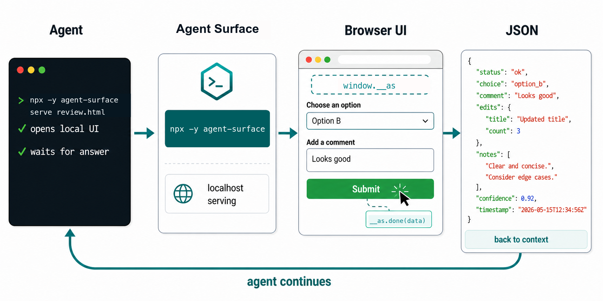
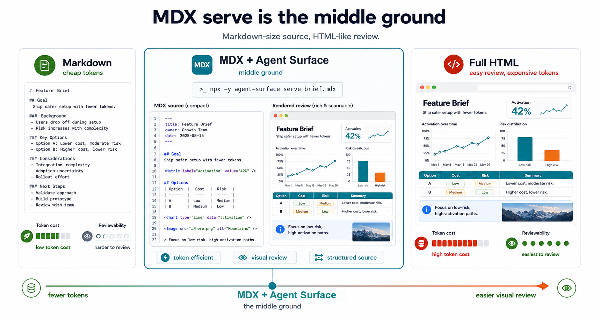
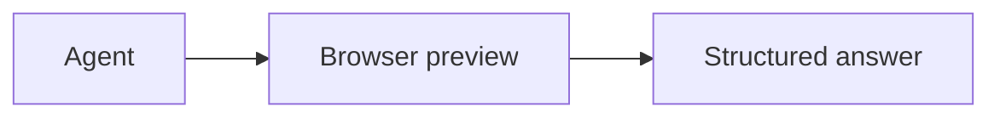
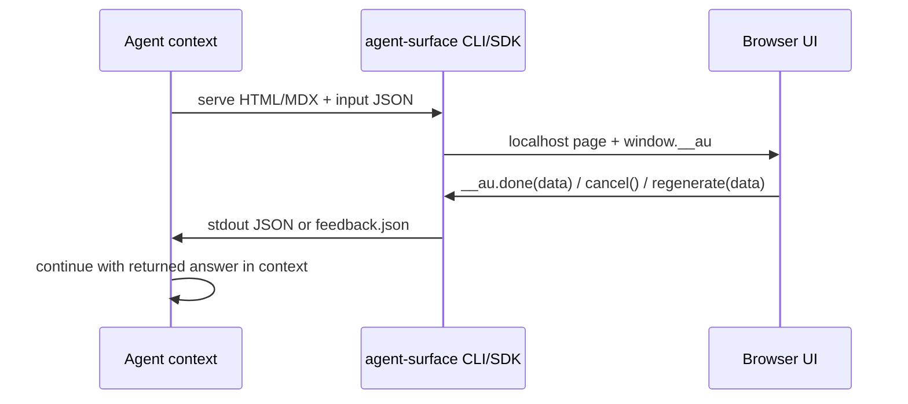
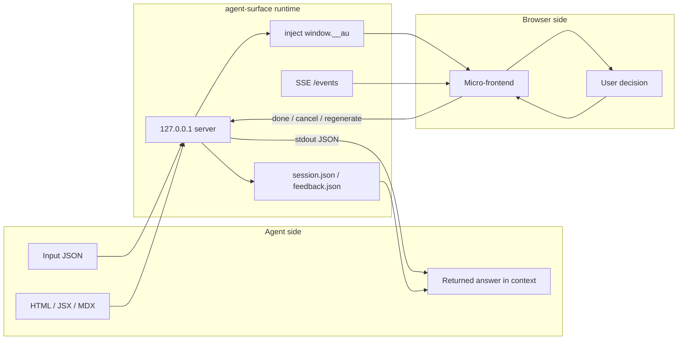

# Agent Surface

Agent Surface lets coding agents open small, local browser interfaces instead of asking humans to answer everything in chat. It serves HTML, JSX, or MDX files, injects a tiny bridge, and returns the user's structured response as JSON.

Use it for pickers, review forms, visual comparison boards, prompt tuners, implementation-plan viewers, and any other throwaway UI where clicking, editing, or scanning beats another wall of Markdown.

## Quick TSX Example

Serve a single TSX file. The host provides React, Tailwind, the bridge, and shadcn-style defaults for supported `@/components/ui/...` imports.

```bash
npx -y agent-surface serve some-name.tsx \
  --data '{"title":"Ship decision","options":[{"id":"approve","label":"Approve","description":"Looks ready to move forward."},{"id":"revise","label":"Revise","description":"Send it back with notes."}]}'
```

```tsx
// some-name.tsx
import { Badge } from "@/components/ui/badge";
import { Button } from "@/components/ui/button";
import {
  Card,
  CardContent,
  CardDescription,
  CardFooter,
  CardHeader,
  CardTitle,
} from "@/components/ui/card";
import { Input } from "@/components/ui/input";
import { Textarea } from "@/components/ui/textarea";
import { useState } from "react";

function App() {
  const {
    title = "Review",
    options = [
      { id: "approve", label: "Approve", description: "Looks ready." },
      { id: "revise", label: "Revise", description: "Needs another pass." },
    ],
  } = window.__au.data;
  const [selected, setSelected] = useState(options[0]?.id);
  const [reviewer, setReviewer] = useState("");
  const [note, setNote] = useState("");

  return (
    <main className="min-h-screen bg-slate-50 p-6 text-slate-950">
      <section className="mx-auto max-w-3xl space-y-4">
        <div className="flex items-center justify-between gap-3">
          <div>
            <Badge variant="blue">Agent UI</Badge>
            <h1 className="mt-3 text-2xl font-semibold">{title}</h1>
          </div>
          <Badge variant="outline">Tailwind + shadcn</Badge>
        </div>

        <div className="grid gap-3 md:grid-cols-2">
          {options.map((option) => (
            <Card
              key={option.id}
              className={selected === option.id ? "border-blue-500 ring-2 ring-blue-100" : ""}
              onClick={() => setSelected(option.id)}
            >
              <CardHeader>
                <CardTitle>{option.label}</CardTitle>
                <CardDescription>{option.description}</CardDescription>
              </CardHeader>
            </Card>
          ))}
        </div>

        <Card>
          <CardHeader>
            <CardTitle>Response</CardTitle>
            <CardDescription>Optional details returned to the agent.</CardDescription>
          </CardHeader>
          <CardContent className="grid gap-3">
            <Input
              placeholder="Reviewer"
              value={reviewer}
              onChange={(event) => setReviewer(event.target.value)}
            />
            <Textarea
              placeholder="Notes"
              value={note}
              onChange={(event) => setNote(event.target.value)}
            />
          </CardContent>
          <CardFooter className="justify-end gap-2">
            <Button variant="ghost" onClick={() => window.__au.cancel()}>
              Cancel
            </Button>
            <Button onClick={() => window.__au.done({ selected, reviewer, note })}>
              Submit
            </Button>
          </CardFooter>
        </Card>
      </section>
    </main>
  );
}
```

You can also serve a remote source URL directly. GitHub `blob` URLs are fetched
through `gh api`, so private repositories work with the user's existing GitHub
CLI authentication. Other HTTP(S) URLs are fetched as plain text with `curl`.

```bash
npx -y agent-surface serve \
  https://github.com/vltansky/agent-surface/blob/master/packages/web/src/pages/IndexPage.tsx
```



## Why It Exists

Agents are good at generating interfaces on demand. Humans are better at choosing from a real interface than from a long prompt thread.

Agent Surface keeps the decision moment visual while preserving an automation-friendly contract: the browser returns structured JSON, and the agent continues the same task with that answer in context.

## Run With Npx

No global install is needed.

```bash
npx -y agent-surface serve review.html
```

Pass data into the page:

```bash
npx -y agent-surface serve review.jsx \
  --data-file /tmp/review-data.json
```

Run without opening a browser, useful for tests or agent-controlled flows:

```bash
npx -y agent-surface serve picker.jsx --no-open
```

Use a bundled template:

```bash
npx -y agent-surface serve \
  --template form \
  --data '{"title":"Review","screens":[]}'
```

## Authoring HTML And MDX

Raw HTML works:

```html
<!doctype html>
<html>
  <body>
    <button onclick="window.__au.done({ approved: true })">
      Approve
    </button>
  </body>
</html>
```

JSX and TSX work too. Agent Surface bundles local React files, wraps them with
React, ReactDOM, Tailwind, the bridge, and `window.__au.data`, and provides a
small default shadcn-style component surface through normal imports.

```jsx
import { Button } from "@/components/ui/button";

function App() {
  const { title = "Pick one", items = [] } = window.__au.data;

  return (
    <main className="p-6">
      <h1 className="text-xl font-semibold">{title}</h1>
      {items.map((item) => (
        <Button
          key={item.id}
          className="mt-3"
          onClick={() => window.__au.done({ selected: item.id })}
        >
          {item.label}
        </Button>
      ))}
    </main>
  );
}
```

For JSX/TSX, `@/` resolves to the served root. Local files such as
`components/ui/button.tsx` override the host defaults, while missing known
defaults fall back to the runtime-provided shadcn-compatible components. There
are no component globals: use imports instead of `window.AU`, `window.shadcn`,
`AU.*`, or `shadcn.*`.

The default host modules are:

- `@/components/ui/button`: `Button`
- `@/components/ui/card`: `Card`, `CardHeader`, `CardTitle`, `CardDescription`, `CardContent`, `CardFooter`
- `@/components/ui/input`: `Input`
- `@/components/ui/textarea`: `Textarea`
- `@/components/ui/badge`: `Badge`
- `@/lib/utils`: `cn`

Relative imports resolve from the importing file. Other local `@/` imports
resolve from the served root, so you can add modules such as
`components/ui/date-picker.tsx` and import them as
`@/components/ui/date-picker`. Unsupported bare package imports fail before the
browser opens.

MDX works for text-first reviews that need richer local structure while staying easy for agents to inspect. Agent Surface keeps MDX constrained: arbitrary imports are disabled, and shadcn-style `@/components/ui/...` imports are the primary component authoring model.



```mdx
---
title: Review Brief
runtime: shadcn
---
import { Card, CardContent, CardHeader, CardTitle } from '@/components/ui/card'
import { Button } from '@/components/ui/button'

# Review Brief

<Card>
<CardHeader>
<CardTitle>
Review details
</CardTitle>
</CardHeader>
<CardContent>

- Source: exact content is available at `/source.mdx`
- Plain text: normalized agent-readable content is available at `/plain.md`
- Metadata: title, hash, headings, links, runtime mode, and components are available at `/metadata.json`

<Button className="mt-4">
Review
</Button>

</CardContent>
</Card>
```

MDX has two runtime modes:

| Mode | How to enable | Styling/runtime |
|------|---------------|-----------------|
| `shadcn` | Default, or `runtime: shadcn` | Tailwind CSS plus shadcn-style `@/components/ui/...` imports |


### MDX Runtime

MDX in Agent Surface is meant for local review, not for arbitrary React apps. Use it when the source should stay text-first and diffable, but the browser preview needs richer scanning structure than plain Markdown.

| Format | Best for | Tradeoff |
|---|---|---|
| `.md` | Specs, notes, research, and other source files that should stay maximally portable | Most readable source, but limited visual hierarchy |
| `.mdx` | Source-first reviews with callouts, comparisons, timelines, tables, risks, or quotes | Constrained runtime; only approved MDX component imports are supported |
| `.html` / `.jsx` | Custom forms, prototypes, pickers, dashboards, or app-like interactions | Full control, but no normalized MDX source/plain-text/metadata routes |

Approved MDX shadcn components use the same import style as JSX/TSX served by
Agent Surface:

```mdx
import { Button } from '@/components/ui/button'
import { Card, CardContent, CardHeader, CardTitle } from '@/components/ui/card'
```

These imports are authoring aliases into the controlled MDX preview runtime:
Agent Surface owns the safe rendering so artifacts stay local-first, while authors
can use familiar shadcn-compatible component names without `window.AU`,
`window.shadcn`, `AU.*`, or `shadcn.*` globals.

Use `agent-surface/mdx` for MDX-only helpers that do not have a natural
shadcn file path: report primitives, chart wrappers, aggregate component maps,
and wrapper hooks.

```mdx
import { ChartBar, ExecutiveSummary, MetricStrip } from 'agent-surface/mdx'
```

That subpath also exports `MDX_COMPONENTS`, `createMdxComponents()`, and
`useMDXComponents()` for wrappers that need the whole approved component map
instead of individual imports.

Unsupported imports fail before the server starts. This keeps previews local-first and predictable for both humans and agents. The shadcn component names are exposed as a safe MDX authoring surface; Agent Surface renders them through its controlled preview runtime rather than importing arbitrary shadcn source. Report primitives such as `ExecutiveSummary`, `MetricStrip`, `Finding`, `Evidence`, `DecisionTable`, and `Figure` render source-first Markdown as polished review sections. The chart wrappers (`ChartArea`, `ChartBar`, `ChartLine`, `ChartPie`) accept simple Markdown children like `- Label: 42`; use `.jsx` or `.html` when you need direct shadcn source, arbitrary chart libraries, state, filtering, or custom interactions.

Approved MDX components preserve string `className` and `class` attributes, so
agents can use Tailwind utilities while keeping the renderer constrained:

```mdx
<Callout className="border-red-500 bg-red-50 p-6">
Review the changed instructions before merging.
</Callout>
```

Fenced Mermaid blocks render as diagrams in the MDX preview and remain intact in `/source.mdx` and `/plain.md`:

````mdx

````

While serving an `.mdx` file, Agent Surface exposes these routes:

| Route | Consumer | What it returns |
|---|---|---|
| `/` and `/index.html` | Human reviewer | Rendered MDX preview |
| `/source.mdx` | Agent/tooling | Exact editable source |
| `/plain.md` | Agent/tooling | Normalized text with MDX components summarized |
| `/metadata.json` | Agent/tooling | Title, frontmatter, source hash, heading line numbers, section ranges/text, links, runtime mode, and component names |

Tools can call this runtime directly or wrap it behind their own command. For
`AGENTS.md`-style instruction artifacts, agents should prefer `/metadata.json`
for section navigation and `/plain.md` for the normalized text they quote or
summarize. Tools can delegate MDX rendering, Tailwind rendering, bridge
APIs, and source routes to `agent-surface` so the MDX serving contract has one
owner.

## Agent Contract

The browser is temporary. The answer comes back to the agent as JSON.



Final payload shape:

```json
{"action":"done","data":{"selected":"concept-a"}}
```

## How It Works

Agent Surface is a local micro-frontend host. The page gets `window.__au`; the agent gets stdout JSON or files from `--session-dir`.



Browser surface:

| Surface | Purpose |
|---|---|
| `window.__au.data` | Initial data from `--data`, `--data-file`, or watch transforms |
| `window.__au.done(data)` | Return a success payload to the agent |
| `window.__au.cancel()` | Return cancellation and exit `1` |
| `window.__au.regenerate(data)` | Return structured feedback for another agent pass |
| `window.__au.subscribe(handler)` | Receive live watch updates |

Agent return paths:

| Mode | Return path |
|---|---|
| Blocking | stdout JSON becomes the next agent input |
| Background | `feedback.json` is read from `--session-dir` |
| Running server | `session.json` has `{ "port", "url", "pid" }` |
| Recovery | Browser can copy/download the JSON if the server is gone |

MDX files also expose agent-readable routes while the preview server is running:

| Route | Purpose |
|---|---|
| `/source.mdx` | Exact MDX source |
| `/plain.md` | Normalized text with MDX components summarized |
| `/metadata.json` | Title, frontmatter, source hash, heading line numbers, section ranges/text, links, runtime mode, and component names |

## SDK

Use the SDK when another tool wants to expose the same behavior behind its own CLI. The MDX component surface is exported separately from `agent-surface/mdx`, while the preview server remains owned by `agent-surface serve`.

```ts
import { serveUI, injectBridge, startServer } from "agent-surface";
```

### `serveUI(args)`

Runs the full CLI-compatible flow in process. This is intended for CLI wrappers and preserves CLI-style process exit behavior.

```ts
import { serveUI } from "agent-surface";

await serveUI([
  "review.html",
  "--data-file",
  "/tmp/input.json",
  "--no-open",
]);
```

### `startServer(html, options)`

Starts the HTTP server directly after you have already produced HTML. This is the SDK-safe entry point: it returns a handle and does not exit the host process.

```ts
import { startServer, type ServeOptions } from "agent-surface";

const options: ServeOptions = {
  filePath: "/tmp/review.html",
  rootDir: "/tmp",
  dataJson: JSON.stringify({ title: "Review" }),
  timeout: 0,
  noOpen: true,
  port: 0,

  multi: false,
  sessionDir: "/tmp/agent-surface-session",
  watch: [],
  transformPath: "",
  projectDir: process.cwd(),
  reuseKey: "",
  printSummary: false,
  _rootWasExplicit: false,
};

const handle = await startServer("<!doctype html><html><body>...</body></html>", options);
console.error(`Serving at ${handle.url}`);

const result = await handle.result;
console.log(result.payload, result.exitCode);
```

### `buildJsxBundleFromFiles(options)`

Bundles generated JSX/TSX without first writing a file tree to disk. Virtual
files use the same import rules as `serve`: relative imports resolve from the
importing file, `@/` resolves from the virtual root first, and host modules fill
in missing supported imports.

```ts
import { buildJsxBundleFromFiles } from "agent-surface";

const js = await buildJsxBundleFromFiles({
  entryFile: "App.tsx",
  files: {
    "App.tsx": `
      import { Button } from "@/components/ui/button";
      import { Panel } from "./Panel";

      function App() {
        return <Panel action={<Button>Done</Button>} />;
      }
    `,
    "Panel.tsx": `
      export function Panel({ action }) {
        return <section className="p-6">{action}</section>;
      }
    `,
  },
  hostModules: {
    "@/components/ui/switch": `
      export function Switch() {
        return <button role="switch">Toggle</button>;
      }
    `,
  },
});
```

### `injectBridge(html, port, multi, dataJson, sessionToken, watchMode)`

Injects the browser bridge into raw HTML. Use this only when you own the server lifecycle yourself.

```ts
import { injectBridge } from "agent-surface";

const html = injectBridge(sourceHtml, 4177, false, "{}", "token", false);
```

## CLI Options

The first positional argument is the HTML, JSX, TSX, MDX, or remote source URL to serve. It can be:

- `file.html`: served as raw HTML with the bridge and data injected.
- `file.jsx` / `file.tsx`: bundled into a browser runtime with React, ReactDOM, Tailwind, local imports, shadcn-style host defaults, and the bridge.
- `file.mdx`: rendered through the constrained MDX runtime with source, plain text, and metadata routes.
- `https://github.com/<owner>/<repo>/blob/<ref>/<path>`: fetched through `gh api`, then served by file type.
- Any other `http://` or `https://` URL: fetched with `curl`, then served by file type.
- A bundled template selected with `--template picker` or `--template form`.

```bash
npx -y agent-surface serve <file.html|file.jsx|file.tsx|file.mdx|url> \
  --data '{"key":"value"}' \
  --data-file data.json \
  --timeout 300000 \
  --no-open \
  --port 4177 \
  --session-dir /tmp/agent-surface \
  --watch "src/**/*.ts" \
  --transform ./build-review-data.js \
  --project-dir "$PWD" \
  --reuse stable-key \
  --print-summary
```

### Inputs

Use `--data` for small inline JSON and `--data-file` for generated payloads:

```bash
npx -y agent-surface serve picker.jsx \
  --data '{"title":"Pick one","items":[{"id":"a","label":"A"}]}'

npx -y agent-surface serve picker.jsx \
  --data-file /tmp/agent-surface-input.json
```

The JSON is available as `window.__au.data`. Invalid JSON fails before the browser opens.

Use `--template` when the agent wants a known UI shell without writing a local JSX file:

```bash
npx -y agent-surface serve \
  --template picker \
  --data-file /tmp/options.json
```

### Files And Roots

By default, static files are served from the input file's directory. Use `--root` to serve a larger HTML/MDX folder:

```bash
npx -y agent-surface serve ./reviews/index.html \
  --root ./reviews
```

Use `--project-dir` to define the safe boundary for browser actions that open host files through `/api/open`.

```bash
npx -y agent-surface serve review.jsx \
  --project-dir "$PWD"
```

### Watch Mode

Watch mode is for live previews. It watches one or more globs, runs a transform script, and broadcasts updated `window.__au.data` to the browser over Server-Sent Events.

```bash
npx -y agent-surface serve dashboard.jsx \
  --watch "reviews/**/*.md" \
  --watch "src/**/*.ts" \
  --transform ./scripts/build-dashboard-data.js \
  --project-dir "$PWD"
```

The transform module is loaded from `--transform` and runs once before the first page load, then again after watched files change. It should return JSON-serializable data. If it returns `{ value, summary }`, `value` becomes `window.__au.data`; with `--print-summary`, `summary` is printed to stdout whenever the transform runs.

`--watch` requires `--transform`. Without an explicit `--timeout`, watch mode disables the normal TTL so the browser session can stay alive while a tab is connected.

### Timeout And TTL

`--timeout` is the server TTL in milliseconds:

- Default: 8 hours for normal one-shot forms and pickers.
- `--timeout 300000`: exit after 5 minutes if the user has not submitted.
- `--timeout 0`: disable the TTL.
- Watch mode: defaults to `0` unless you pass `--timeout` explicitly.

In watch mode, lifecycle is mostly governed by browser connection state: after the last SSE client disconnects, the server exits after `AGENT_UI_EXIT_AFTER_DISCONNECT_MS` or 30 seconds by default.

### Sessions And Reuse

Use `--session-dir` when the agent needs to keep working while the browser is open. Agent Surface writes:

- `session.json` when the server starts.
- `feedback.json` when the user submits.
- `annotations.json` if the UI uses annotations.

```bash
SESSION_DIR=$(mktemp -d)
npx -y agent-surface serve review.jsx \
  --session-dir "$SESSION_DIR" \
  --data-file /tmp/review.json
```

Use `--reuse` for stable long-running UIs. If another live server already owns the same reuse key, Agent Surface prints the existing URL and exits successfully instead of starting a duplicate.

```bash
npx -y agent-surface serve dashboard.jsx \
  --reuse project-dashboard \
  --watch "reviews/**/*" \
  --transform ./scripts/build-dashboard-data.js
```

`--reuse` also scopes persisted browser state under `~/.agent-surface/serve-state/`.

### Browser And Styling

- `--no-open`: start the server without opening a browser. Useful for tests, wrappers, and agent-managed background runs.
- `--port 4177`: bind a specific port. The default `0` lets the OS choose an open port.

## Development

```bash
yarn install
yarn build
yarn test
```

This repository publishes `agent-surface` to the Wix internal npm registry.
