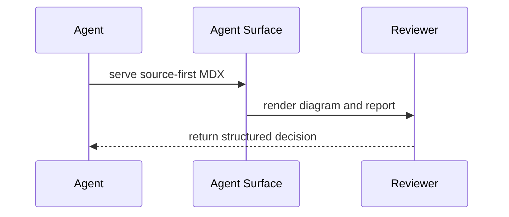

# MDX Capabilities

Use this reference after the `agent-surface-mdx` skill triggers and the task needs component names, examples, or runtime limits.

## Modes

| Mode | How to enable | Styling/runtime |
| --- | --- | --- |
| `shadcn` | Default, or `runtime: shadcn` frontmatter | Tailwind CSS plus controlled shadcn-style imports |

Tailwind CSS is available for static string `className` and `class` attributes. Keep Tailwind small and structural.

```mdx
<Callout className="border-blue-300 bg-blue-50 p-6">
Important review note.
</Callout>
```

## Approved Import Surface

Use shadcn-style imports for familiar UI primitives:

```mdx
import Button from '@/components/ui/button'
import { Card, CardContent, CardHeader, CardTitle } from '@/components/ui/card'
```

Use `agent-surface/mdx` for MDX-only helpers, report primitives, chart wrappers, aggregate component maps, and wrapper hooks:

```mdx
import {
  Callout,
  ChartBar,
  Compare,
  DataTable,
  RiskTable,
  SourceQuote,
  Timeline,
} from 'agent-surface/mdx'
```

Agent Surface validates these names and renders through its controlled preview runtime. This is not direct arbitrary shadcn source execution.

## Useful Components

| Component | Use |
| --- | --- |
| `Callout` | Concise top-level review summary, decision note, or warning |
| `DataTable` | Compact key/value rows such as stage, scope, confidence, owner, mode, and commands |
| `Card` | Reviewable findings, gaps, or implications |
| `SourceQuote` | Source notes, constraints, quotes, logs, or screenshots summarized as evidence |
| `RiskTable` | Options, decisions, tradeoffs, risks, and review notes |
| `ChartArea`, `ChartBar`, `ChartLine`, `ChartPie` | Lightweight charts from Markdown list data |
| Fenced `mermaid` blocks | Static flowcharts, sequence diagrams, state diagrams, and architecture sketches |
| `Timeline` | Sequenced research, implementation, rollout, or decisions |
| `Compare` | Before/after, option A/B, current/proposed |
| `Tabs`, `Accordion` | Secondary detail that should stay scannable |

For polished report artifacts, prefer headings plus `Callout`, `DataTable`, `Card`, `SourceQuote`, `RiskTable`, `Timeline`, and `Compare` before generic card-heavy layouts.

For source-first artifacts, use `/metadata.json` for navigation. Metadata includes frontmatter, heading line numbers, section ranges/text, links, runtime mode, and component names. Use `/plain.md` for normalized text to quote or summarize.

```bash
curl -s http://127.0.0.1:4173/metadata.json | jq '.sections[] | {title, startLine, endLine}'
curl -s http://127.0.0.1:4173/plain.md
```

## Chart Example

```mdx
import { ChartBar } from 'agent-surface/mdx'

<ChartBar>
- PMs: 35
- Designers: 25
- UX Writers: 15
- Business Analysts: 25
</ChartBar>
```

Use chart wrappers for simple data. Use `.html`, `.jsx`, or `.tsx` when the artifact needs filters, state, custom tooltips, Recharts directly, or arbitrary chart libraries.

## Mermaid Example

Mermaid diagrams do not require an import. Use a standard fenced block:

````mdx

````

Use Mermaid when a diagram makes relationships clearer than prose. Keep it static and readable in source; choose `.html`, `.jsx`, or `.tsx` for interactive diagramming, filters, or custom JavaScript.

## Good MDX Source Habits

- Keep prose as normal Markdown wherever possible.
- Add imports only for components used in the file.
- Put one concept inside each component; avoid nested component soup.
- Use lists inside report primitives because they degrade cleanly into `/plain.md`.
- Prefer short labels and direct review language.
- Serve and inspect the page; MDX is for human review as well as agent routes.

## Limits

- No arbitrary imports.
- No direct shadcn source execution.
- No project-local components.
- No direct custom charting imports.
- No event handlers, dynamic props, or app state.
- No custom Mermaid runtime imports; use fenced `mermaid` blocks.

If those limits are too tight, switch the artifact to `.html`, `.jsx`, or `.tsx` and serve it with Agent Surface instead of forcing MDX.
